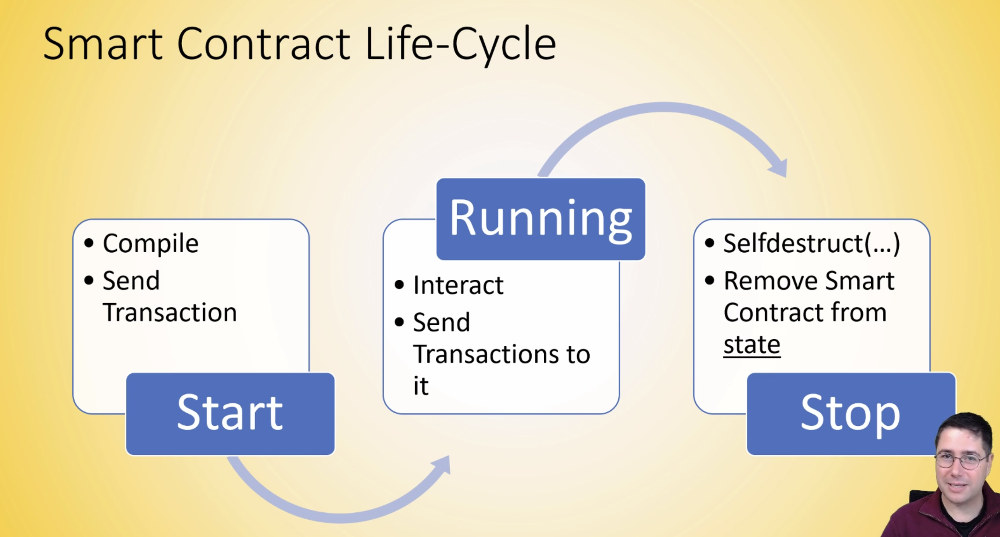

* Smart contract get compiled and sent back to the blockchain as a transaction
* Transaction once mined is immutable
* Immutability means:
  * Data can't be deleted
* Once a contract is destroyed it can't be undone


```
export SPARK_HOME=/Users/`whoami`/install/spark-3.1.2-bin-hadoop3.2.tgz
```
