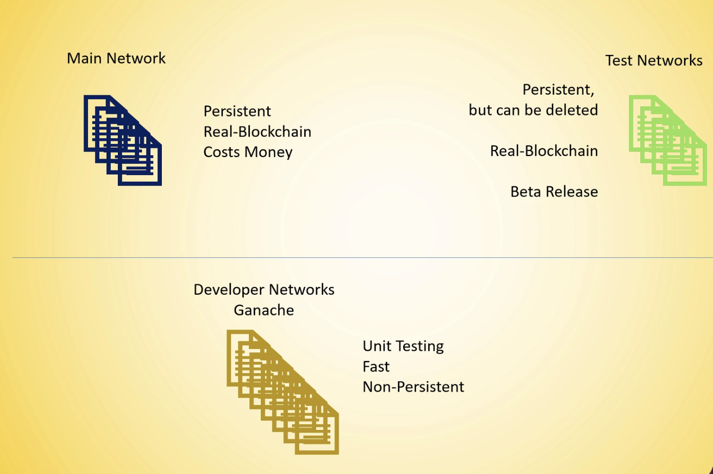

## Create your first editor

* Create a file MyContract.so
* Enter the following code
* ```
  // SPDX-License-Identifier: GPL-3.0

  pragma solidity ^0.8.1;

  contract MyContract {
      string public myString = 'hello world';
  }
  ```

## Deploy the contract

* Select environment (injected web3)
* Connect to metamask
* Click on deploy
* Confirm the transaction

### Different type of Eth Network



### All Ethereum Networks
* Same way storing data
* Same way to access data

### Live Network
* This will cost you real money due to gas and transaction fees

### Test Network
* Test Small Contracts
* Test Protocol Updates

### Private Networks
* Run your own blockchain

## Deploy Contract on Ganache
1. Select Web3 Provider (from environment)
2. Edit the address in remix and change it to the same address which is there on Ganache
3. deploy the contract and check the test transactions
